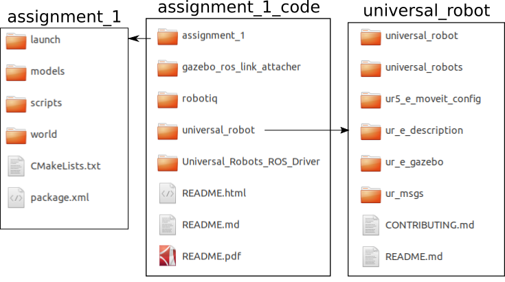
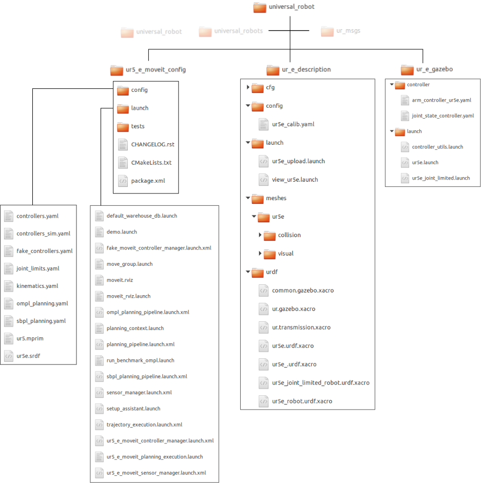
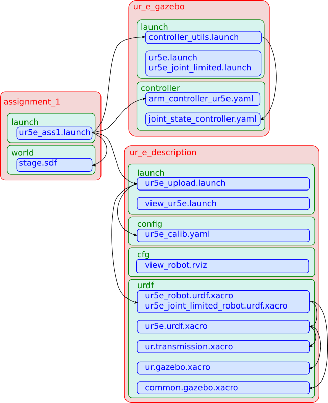

% UR5e in Gazebo and MoveIt!

- Author: Tejaswi Digumarti (tejaswi.digumarti@sydney.edu.au)
- Last Updated: 17th May 2020

## Foreword
This document provides explains how to simulate a UR5e arm in Gazebo and control it using MoveIt via ROS.
I have tried to provide a high-level overview of the fundamentals of simulation in Gazebo and go into implementation details only for the UR5e arm.
Similar is the case for MoveIt!
To keep this document concise, I have provided links to resources wherever I felt that the content was already presented in a good form and a repetition of it in this document is not necessary.
I encourage the reader to check them out for a complete understanding of the topic.

Instead of starting from scratch and building our way up, I will present the content in a top-down approach where we will begin with a fully functioning simulation and then disect it to understand the various parts of the framework, and how they interact with each other.

The target audience is the students of the MTRX5700 - Experimental Robotics course at the University of Sydney.
This document describes how the simulation framework for Assignments 1 and 2 was build and how you can modify it for your major projects.
While only UR5e is covered in detail, the document is also useful for those who are simulating other robots.

## Introduction
### Gazebo
Gazebo was originally developed for the purpose of simulating outdoor environments with high-fidelity, by Dr. Andrew howard and Nate Koenig at the University of Southern California in 2002 [[ref]](http://gazebosim.org/). It was part of the [Player/Stage Project](http://robotics.stanford.edu/~gerkey/research/final_papers/icar03-player.pdf) along with Player (clean interface to robots and sensors) and Stage (multiple robots simulator). In the subsequent years it gained independent popularity and has grown to become the go to simulator in Robotics for both indoor and outdoor environments. As a result several robots and environmets have been simulated in Gazebo and are available for use by the community. 

Some popular ones are   
- [PR2](http://wiki.ros.org/pr2_simulator/Tutorials)  
- [Pioneer P3DX](https://github.com/RafBerkvens/ua_ros_p3dx)  
- [Baxter](https://github.com/RethinkRobotics/sdk-docs/wiki/Using-Gazebo-and-Baxter)  
- [TurtleBot](http://wiki.ros.org/turtlebot_gazebo/Tutorials/indigo/Explore%20the%20Gazebo%20world)  
- [UR5](https://github.com/ros-industrial/universal_robot)  
- [RotorS](https://github.com/ethz-asl/rotors_simulator/wiki)  
- [Duckietown](https://github.com/duckietown/duckietown-sim-server)  

In recent years, there are also a growing number of simulators that are taking advantage of game engines like Unity and Unreal Engine, especially for their high-fidelity graphics capabilities (I personally use Unreal Engine). These are typically used where photo-realism is desired. In cases where photo-realism is an overkill, Gazebo is still the simulation environment of choice for modelling many robots and enviornments.

### Gazebo and ROS
Gazebo is a standalone simulation framework that can be used to model objects, mechanisms, environments and the interaction between them, i.e. physics. Hence it can be used to model robots. It is not necessary to use Gazebo with ROS, but using it along with ROS makes it interesting for a few reasons. In the context of this course, the most important reason is that Gazebo can be used as a drop in replacement for the real world, provided that the modelling is done reasonably well. One can use the same code written using ROS to test in simulation and directly deploy it on the real robot.

### MoveIt!
MoveIt! is a motion planning and manipulation toolkit for ROS [[ref]](https://moveit.ros.org/), initially developed at Willow garage in 2011. It is now an open source project with several companies and universities contributing and maintianing it.

In the context of this document, we will be using MoveIT! to control the UR5e arm.

## Building Simulations
This is probably what you are reading this document for.
I will cover this section in detail taking the example of the simulation environment for Assignments 1 and 2 that uses the UR5e arm.
For other robots or environments, please refer to one of the links in the introduction section.
*Note: Some of the frameworks may be outdated and no longer be maintained, but are still useful from an educational point of view.*

The main references for this section are the [Gazebo Tutorials](http://gazebosim.org/tutorials?cat=guided_b) and [MoveIt! Tutorials](https://ros-planning.github.io/moveit_tutorials/).
You can also continue reading this document and refer to them when in doubt.
I will cover some fundamentals in this document as well.

Let us now take a dive directly into the simulation framework and try to understand how everything works.

### Filesystem overview
If you look at the code that was distributed with assignment 1 (available on canvas) in the folder **assignment_1_code**, it is organized as follows.

<center>

</center>
Figure 1 - Main folders and their contents in the code for assignment_1.

The two main folders are  
1. **universal_robot**:  containing code relevant to the UR5e robotic arm such as its description in simulation, its configuration for MoveIt!, its forward kinematics, its CAD model etc.  
2. **assignment_1**: containing code specific to the assignment  

#### universal_robot
We shall focus on three subfolders which are relevant to this dicussion.  
1. **ur5_e_moveit_config**: This is where the configuration files required by MoveIt are present.  
2. **ur_e_description**: This is where the files that describe the model of the arm are present.  
3. **ur_e_gazebo**: This is where the controllers used in gazebo are defined.  

<center>

</center>
Figure 2 - Folders in universal_robot

#### assignment_1
This fodler is organized as follows.

<center>

</center>
Figure 3 - Folders in assignment_1

From the pictures above, it may seem that things are very complicated, but each file just describes one functionality, e.g. the controllers are defined in controllers.yaml, kinematics are described in kinematics.yaml, the robot itself is described in ur5e.urdf.xacro and so on.
Most of the files are written in derivatives of the **xml** file format.
We shall see specific examples later in the document.

### Workflow
#### Robot Simulation
A simulated model of the robot is launched when you launch the assignment_1 launch script.
```bash
roslaunch assignment_1 ur5e_ass1.launch
```
Figure 4 shows the files that are involved in this workflow.
The files where the robot and world models are described are highlighted in yellow.  

1. **Gazebo World**  
**stage.sdf**: This is where the gazebo *world* is described. 
It is defined in the [**SDFormat specification**](http://sdformat.org/spec). 
The format is again a derivative of XML and has elements describing the world, lighting, physics, models, actors, links, joints, sensors, collision etc. 
In our simulation, this is where we define the table, the pillars and the blocks.
**Refer to the section on...... for more details**

2. **Robot**  
**ur5e_upload.launch**: 
	- Loads the kinematic configuration from the file **ur5e_calib.yaml**, where the poses of each joint with respect to its parent joint are specified.  
	- Loads the robot model from the file **ur5e_robot.urdf.xacro** or its joint limited counterpart **ur5e_joint_limited_robot.urdf.xacro**. These files in turn use the following files.  
		- **common.gazebo.xacro**: Loads the *libgazebo_ros_control* plugin  
		- **ur5e.urdf.xacro**: Describes the robot using the [**URDF Specification**](http://wiki.ros.org/urdf), which is very similar to the **SDFormat Specification**, but with only the parts that describe the model. Simply put, this file is an alternating sequence of joints and link describing the robot. For each joint, we specify the links it connects, its pose wrt. it parent and its type. FOr each link, we describe how it should look like (visual), its collision geometry (collision) and moment of inertia.  
		**Fun fact**: Our guest speaker Dr. Ioan Sucan was one of the co-authors of URDF. 
			- **ur.gazebo.xacro**: Sets self-collision parameters for links.  
			- **ur.transmission.xacro**: Describes the transmission (motors/gears) at each joint.

3. **Controllers**  
**controller_utils.launch**: This file launches the node that publishes the state of the robot, joint calibration info (fake) and loads the joint state controller from *joint_state_controller.yaml*  
**arm_controller_ur5e.yaml**: This file sets the joints that the controllers affect and some constraints. In this file parameters for two controllers are defined.

<center>

</center>
Figure 4 - Files used in the simulation of the robot


### How to modify the simulation

Creating new models and describing them in the sdf format. Links, Joints, Visuals and Collisions.


#### URDF
#### SDF
#### Textures
#### Models


