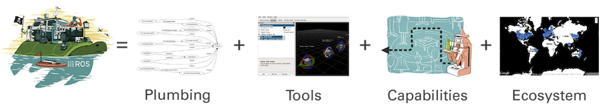

% An Absolute Beginner's Introduction to Robot Operating System (ROS<sup>TM</sup>)

- Author: Tejaswi Digumarti (tejaswi.digumarti@sydney.edu.au)
- Last Updated: 5th March 2020

## Foreword
This document provides a very brief introduction to Robot Operating System (ROS) and some of its components.
This document also assumes that the reader is an absolute beginner to ROS and has minimal understanding of Linux build systems.
This means that quite a few techincal details are skipped in favour of providing a high level understanding. 
Wherever possible, links to technical content are provided.
As a result, while this document provides the reader with sufficient knowledge to start working with robots, it is in no way a comprehensive guide on ROS.

## 1. Introduction
### What is ROS?
ROS is a framework for writing software for robots. 
Even though the name contains the term *Operating System*, it is not a complete operating system.
It is rather a collection of software tools and libraries that enables programming complex robot behaviours across a wide variety of robot platforms. (see [1](https://www.ros.org/about-ros/), [2](http://wiki.ros.org/)) The tools that ROS offers can be categorized as shown in Table 1 and illustrated in Figure 1.

Table 1 - Summary of some key components ROS (from [3](https://www.researchgate.net/publication/314101187_Programming_for_Robotics_-_Introduction_to_ROS)).

| Plumbing | Tools | Capabilities | Ecosystem |
|----|----|----|----|
| Process Management | Visualization | Control | Package Organization |
| Inter-process Communication | Simulation | Planning | Software Distribution |
| Device Drivers | GUI | Perception | Documentation |
| | Data Logging | Mapping | Tutorials |
| | Hardware Abstraction | Manipulation | Forums | 


Figure 1 - Illustration of the components of ROS (from [1](https://www.ros.org/about-ros/)).

### Why use ROS?
1. ROS is modular meaning one can choose to use only specific components of ROS in their frameworks.  
2. ROS programs can be distributed across multiple computers.  
3. ROS modules can be written in multiple languages, as long as a client library exists (e.g. C++, Python, Matlab, Java).  
4. ROS can be used as a generic tool to interact with multiple robot platforms, by abstracting away the hardware.  
5. ROS has a large community of users which enables transfer of knowledge and code across industry and academia which helps in collaborative research and product development.
6. ROS has a permissive license (three-clause BSD) enabling reuse in both open source and closed source products. Code built using ROS can also be commercialized.  

### History
ROS was originally developed in 2000s at Stanford University and further developed by Willow Garage from 2007-2013.
The first official release of ROS was ROS Box Turtle which was released on 2nd March, 2010.
Since 2013 the Open Source Robotics Foundation has been managing and maintaining ROS.

Check [this](http://wiki.ros.org/Distributions) link for all the cool ROS turtles.

### Versions and Operating Systems
There are two main versions of ROS; ROS 1 and ROS 2.
ROS 2 is still in its early stages, at the time of this document, and has not been fully adopted by the community.
Hence this document will only cover topics related to ROS 1. 
Throughout this document when we use ROS, we refer to ROS 1.
The latest long term stable distribution of ROS 1 at the time of this document is [ROS Melodic Morenia](http://wiki.ros.org/melodic).


Figure 2 - The logo of ROS Melodic Morenia.

While it is possible to install ROS in Linux, MacOS and Windows, it is easiest to install in Linux.
We shall assume that the operating system of the user is Linux (more specifically Ubuntu 18.04).

## 2. The Workspace
Software developed using ROS is generally written in a ROS workspace - more commonly referred to as a **catkin** workspace.
In simple terms a catkin workspace is just a folder with some special settings in it.
These settings make sure that software packages written by a user are built and maintained in a clean way, with all the dependencies being found correctly, and let ROS be aware of these packages.
One may create as many catkin workspaces as desired, however it is a good practice to group packages with a common end application into one workspace.

A catkin workspace can be created by first creating a normal folder and invoking the `catkin_init_workspace` or the `catkin init` command (from [python-catkin-tools](https://catkin-tools.readthedocs.io/en/latest/installing.html)).
```bash
mkdir -p catkin_ws/src
cd catkin_ws/src
catkin_init_workspace
```
or 
```bash
mkdir -p catkin_ws/src
cd catkin_ws
catkin init
```
Notes:  
1. `catkin init` is slightly better than `catkin_init_workspace` and is recommended.  
2. `catkin init` is run from the workspace folder while `catkin_init_workspace` is run from the src folder.  
3. Using `catkin_init` creates a hidden folder named *.catkin_tools* inside the workspace folder where the special settings are stored.
4. Using `catkin_init_workspace` creats a file called *CMakeLists.txt* in the src folder. 
This is referred to as the top-level cmake file and is a symbolic link to the file */opt/ros/melodic/share/catkin/cmake/toplevel.cmake*.

### The workspace structure
The workspace consists of 4 main folders