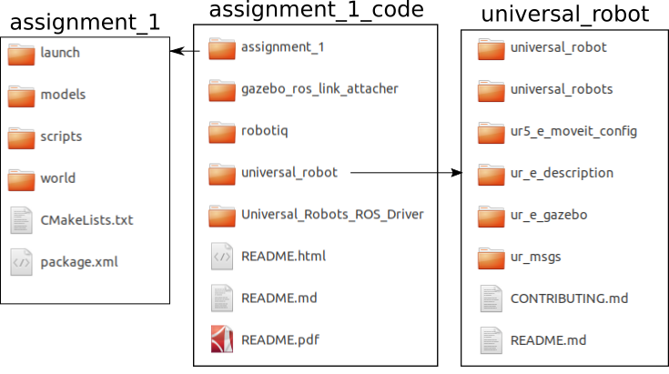
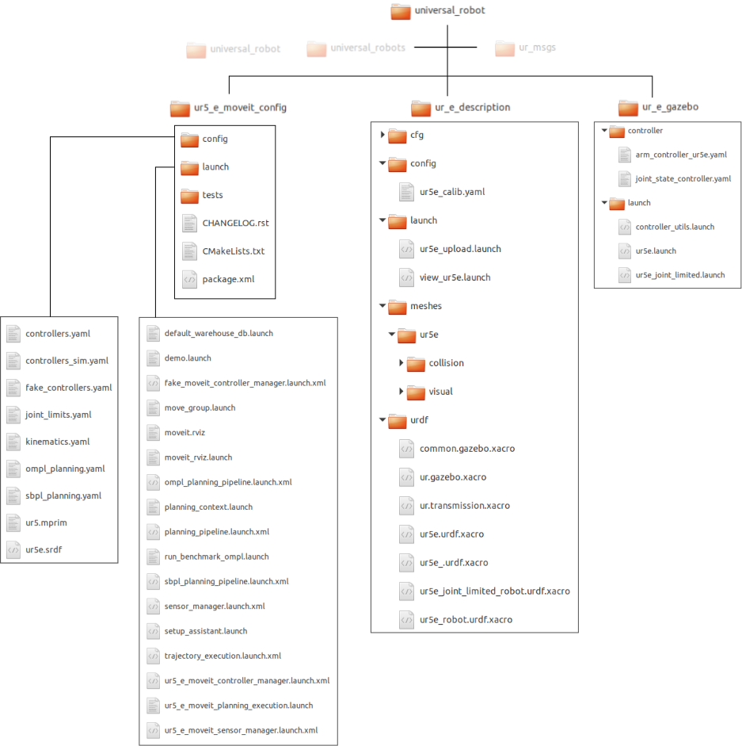
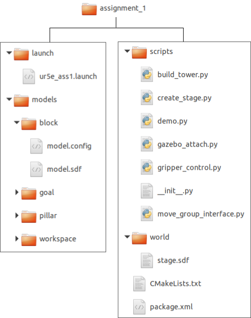
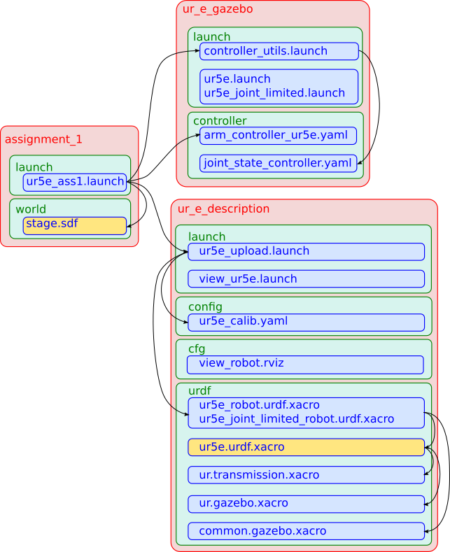
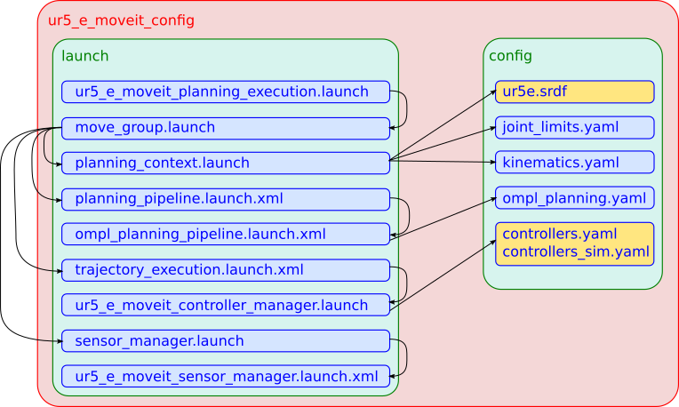
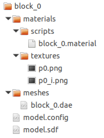

# Introduction to UR5e in Gazebo with ROS and MoveIt!

- Author: Tejaswi Digumarti (tejaswi.digumarti@sydney.edu.au)
- Last Updated: 22th January 2021

## Foreword
This document explains how to simulate a UR5e arm in Gazebo and control it using MoveIt via ROS.
I have tried to provide a high-level overview of the simulation in Gazebo and configuring MoveIt for the UR5e arm.
I have provided links to resources wherever I felt that the necessary implementation details were already presented in a good form and a repetition of it in this document is not necessary.
I encourage the reader to check them out for a complete understanding of the topic.

Instead of starting from scratch and building our way up, I will present the content in a top-down approach where we will begin with a fully functioning simulation and then dissect it to understand the various parts of the framework, and how they interact with each other.

The target audience is the students of the MTRX5700 - Experimental Robotics course at the University of Sydney.
This document describes how the simulation framework for Assignments 1 and 2 was build and how you can modify it for your major projects.
While only UR5e is covered in detail, the document is also useful for those who are simulating other robots.

## Introduction
### Gazebo
Gazebo was originally developed for the purpose of simulating outdoor environments with high-fidelity, by Dr. Andrew howard and Nate Koenig at the University of Southern California in 2002 [[ref]](http://gazebosim.org/). 
It was part of the [Player/Stage Project](http://robotics.stanford.edu/~gerkey/research/final_papers/icar03-player.pdf) along with Player (clean interface to robots and sensors) and Stage (multiple robots simulator). 
In the subsequent years it gained independent popularity and has grown to become the go to simulator in Robotics for both indoor and outdoor environments. 
As a result several robots and environmets have been simulated in Gazebo and are available for use by the community. 

Some popular ones are   
- [PR2](http://wiki.ros.org/pr2_simulator/Tutorials)  
- [Pioneer P3DX](https://github.com/RafBerkvens/ua_ros_p3dx)  
- [Baxter](https://github.com/RethinkRobotics/sdk-docs/wiki/Using-Gazebo-and-Baxter)  
- [TurtleBot](http://wiki.ros.org/turtlebot_gazebo/Tutorials/indigo/Explore%20the%20Gazebo%20world)  
- [UR5](https://github.com/ros-industrial/universal_robot)  
- [RotorS](https://github.com/ethz-asl/rotors_simulator/wiki)  
- [Duckietown](https://github.com/duckietown/duckietown-sim-server)  

In recent years, there is a growing number of simulators that are taking advantage of game engines like Unity and Unreal Engine, especially for their high-fidelity graphics capabilities (I personally use Unreal Engine). 
These are typically used where photo-realism is desired. In cases where photo-realism is an overkill, Gazebo is still the simulation environment of choice for modelling many robots and enviornments.

### Gazebo and ROS
Gazebo is a standalone simulation framework that can be used to model objects, mechanisms, environments and the interaction between them, i.e. physics. 
Hence it can be used to model robots. 
It is not necessary to use Gazebo with ROS, but using it along with ROS makes it interesting for a few reasons. 
In the context of this course, the most important reason is that Gazebo can be used as a drop in replacement for the real world, provided that the modelling is done reasonably well. One can use the same code written using ROS to test in simulation and directly deploy it on the real robot.

### MoveIt!
MoveIt! is a motion planning and manipulation toolkit for ROS [[ref]](https://moveit.ros.org/), initially developed at Willow garage in 2011. 
It is now an open source project with several companies and universities contributing and maintianing it.
In the context of this document, we will be using MoveIt! to control the UR5e arm.

## Building Simulations
This is probably what you are reading this document for.
I will cover this section in detail taking the example of the simulation environment for Assignments 1 and 2 that uses the UR5e arm.
For other robots or environments, please refer to one of the links in the introduction section.
*Note: Some of the frameworks may be outdated and no longer be maintained, but are still useful from an educational point of view.*

The main references for this section are the [Gazebo Tutorials](http://gazebosim.org/tutorials?cat=guided_b) and [MoveIt! Tutorials](https://ros-planning.github.io/moveit_tutorials/).
You can also continue reading this document and refer to them when in doubt.
I will cover some fundamentals in this document as well.

Let us now take a dive directly into the simulation framework and try to understand how everything works.

### Filesystem overview
If you look at the code that was distributed with assignment 1 (available on canvas) in the folder **assignment_1_code**, it is organized as follows.

<center>

</center>
Figure 1 - Main folders and their contents in the code for assignment_1.

The two main folders are  
1. **universal_robot**:  containing code relevant to the UR5e robotic arm such as its description in simulation, its configuration for MoveIt!, its forward kinematics, its CAD model etc. shown in Figure 2.  
2. **assignment_1**: containing code specific to the assignment, shown in Figure 3.  

#### universal_robot
We shall focus on three subfolders which are relevant to this dicussion.  
1. **ur5_e_moveit_config**: This is where the configuration files required by MoveIt are present.  
2. **ur_e_description**: This is where the files that describe the model of the arm are present.  
3. **ur_e_gazebo**: This is where the controllers used in gazebo are defined.  

<center>

</center>
Figure 2 - Folders in universal_robot

#### assignment_1
1. **launch**: This is where the main launch script *ur5e_ass1.launch*, that launches the simulation is present.  
2. **models**: This folder contains all the simple models that are used in the simulation - table, blocks, pillars.  
3. **scripts**: This is where the python code is present.  
4. **worlds**: This is where the file that describes the Gazebo world is present. It uses references to the models folder to load models.   

<center>

</center>
Figure 3 - Folders in assignment_1

From the pictures above, it may seem that things are very complicated, but each file just describes one functionality, e.g. the controllers are defined in controllers.yaml, kinematics are described in kinematics.yaml, the robot itself is described in ur5e.urdf.xacro and so on.
Most of the files are written in derivatives of the **xml** file format.

### Workflow
To understand the framework, let us look at the simulation workflow.
If you remember, in your assignments (see the README document for Assignment 1), we launched 5 scripts to start the simulation and build the tower.
The first command was just ```roscore```.
The second and third command are the ones that we will pay close attention to.
These are the ones used to build the simulation (of the robot and the world) and configure MoveIt!.


#### Simulation Environment in Gazebo
A simulation environment with a model of the robot is launched when you launch the assignment_1 launch script.
```bash
roslaunch assignment_1 ur5e_ass1.launch
```
Figure 4 shows the files that are involved in this workflow.
The files that describe the robot model and the world are highlighted in yellow.
**These are the files you will most likely need to modify to make a new simulation**.  

<center>

</center>
Figure 4 - Files used in the simulation of the robot

1. **Describing the Gazebo World**  
**stage.sdf**: This is where the gazebo *world* is described. 
It is defined in the [**SDFormat specification**](http://sdformat.org/spec). 
The format is again a derivative of XML and has elements describing the world, lighting, physics, models, actors, links, joints, sensors, collision etc. 
In our simulation, this is where we define the table, the pillars and the blocks.
For example let us look at how the block is described.
It is of the type *model* and contains a link that is mainly characterized by its visual, collision and inertial elements.
```xml
<!-- The model tag defines that the object is a model-->
<model name='block_1'> 	<!-- Name of the model is block_1 -->

	<!-- Here we define the link -->	
    <link name='link'>
        
        <!-- Moment of Inertia -->
        <inertial>
          <mass>1</mass>
          <inertia>
            <ixx>0.166667</ixx>
            <ixy>0</ixy>
            <ixz>0</ixz>
            <iyy>0.166667</iyy>
            <iyz>0</iyz>
            <izz>0.166667</izz>
          </inertia>
          <pose frame=''>0 0 0 0 -0 0</pose>
        </inertial>
        
        <!-- Visual - This defines how the block should look like-->
        <visual name='visual'>
          <!-- The visual geometry here is just a box, it can also be a mesh-->
          <geometry>
            <box>
              <size>0.08 0.08 0.08</size>
            </box>
          </geometry>
          <!-- The material of the block-->
          <material>
            <shader type='vertex'>
              <normal_map>__default__</normal_map>
            </shader>
            <ambient>1 0.85 0 1</ambient>
            <diffuse>1 0.85 0 1</diffuse>
            <specular>0.01 0.01 0.01 1</specular>
            <emissive>0 0 0 1</emissive>
          </material>

          <pose frame=''>0 0 0 0 -0 0</pose>
          <!-- Other properties-->
          <transparency>0</transparency>
          <cast_shadows>1</cast_shadows>
        </visual>
        
        <!-- Collision Geometry - again here it is simply a box-->
    	<collision name='collision'>
    	  <pose frame=''>0 0 0 0 -0 0</pose>
    	  <geometry>
    	    <box>
    	      <size>0.08 0.08 0.08</size>
    	    </box>
    	  </geometry>
    	</collision>
      
      	<!-- Other physics properties -->
    	<self_collide>0</self_collide>
        <enable_wind>0</enable_wind>
        <kinematic>0</kinematic>
        <pose frame=''>0 0 0 0 -0 0</pose>
        <gravity>1</gravity>

    </link>

    <static>0</static>
    <allow_auto_disable>1</allow_auto_disable>
    <pose frame=''>0.2 0.3 0.041 0 -0 0</pose>
</model>
```

2. **Describing the Robot**  
**ur5e_upload.launch**: 
	- Loads the kinematic configuration from the file **ur5e_calib.yaml**, where the poses of each joint with respect to its parent joint are specified.  
	- Loads the robot model from the file **ur5e_robot.urdf.xacro** or its joint limited counterpart **ur5e_joint_limited_robot.urdf.xacro**. These files in turn use the following files.  
		- **common.gazebo.xacro**: Loads the *libgazebo_ros_control* plugin  
		- **ur5e.urdf.xacro**: Describes the robot using the [**URDF Specification**](http://wiki.ros.org/urdf), which is very similar to the **SDFormat Specification**, but with mainly the parts that describe the *model*. Simply put, this file is an alternating sequence of joints and links describing the robot. For each joint, we specify the links it connects, its pose wrt. its parent and its type. For each link, we describe how it should look like (visual), its collision geometry (collision) and moment of inertia. This chain of joints and links for the UR5e is   
		**base_link** -> *shoulder_pan_joint* -> **shoulder_link** -> *shoulder_lift_joint* -> **upper_arm_link** -> *elbow_joint* -> **fore_arm_link** -> *wrist_1_joint* -> **wrist_1_link** -> *wrist_2_joint* -> **wrist_2_link** -> *wrist_3_joint* -> **wrist_3_link** -> *gripper_joint* -> **gripper_link** -> *fingers_joint* -> **fingers_link** ->  *ee_fixed_joint* -> **ee_link**  
			- **ur.gazebo.xacro**: Sets self-collision parameters for links.  
			- **ur.transmission.xacro**: Describes the transmission (motors/gears) at each joint.

	**Fun fact**: Our guest speaker Dr. Ioan Sucan was one of the co-authors of URDF. 

3. **Controllers**  
**controller_utils.launch**: This file launches the node that publishes the state of the robot, joint calibration info (fake) and loads the joint state controller from *joint_state_controller.yaml*  
**arm_controller_ur5e.yaml**: This file sets the joints that the controllers affect and some constraints. In this file parameters for two controllers are defined.

#### MoveIt Configuration
Once the robot and the environment is launched, we launch MoveIt using the following command.
```bash
roslaunch ur5_e_moveit_config ur5_e_moveit_planning_execution.launch sim:=true
```
Figure 5 shows the files that are involved in this workflow.
The files where the controller and the *movegroups* of the robot are described are highlighted in yellow.

<center>

</center>
Figure 5 - Files used in configuring MoveIt for the UR5e robot arm.

1. **ur5_e_moveit_planning_execution.launch**: This is just a launch file to launch **move_group.launch** with some parameters.  
2. **move_group.launch**: This file loads the planning context and launches 3 different functionalities of MoveIt - planning, sensor manager and trajectory execution.  
	- **planning_context.launch**: The planning context is nothing but a description of the robot, its joints and kinematics. This is what this file loads. The description of the robot is loaded from the URDF of the robot (the same file in the previous section) and its corresponding semantic description from the file **ur5e.srdf**. Please look at the comments in the srdf file for more information. This is where the MoveIt *move_group* is defined (as manipulator) and the joints and links in this group are specified. The joint limits are loaded from **joint_limits.yaml** and the kinematics are loaded from **kinematics.yaml**.  
	- **planning_pipeline.launch**: This file launches the required planning plugins, in our case the OMPL plugin using the file **ompl_planning_pipeline.launch.xml** which in turn loads configuration parameters from **ompl_planning.yaml**.  
	- **sensor_manager.launch.xml**: This file launches the required sensor managers, in our case from the file **ur5_e_moveit_sensor_manager.launch.xml** which is actually an empty file!  
	- **trajectory_execution.launch.xml**: This file launches the controller manager from the file **ur5_e_controller_manager.launch.xml** which in turn loads the controllers from **controllers.yaml** or **controllers_sim.yaml**.  

### Modifications made in Assignment 2
In Assignment 2 two key modifications were made.
The first is the addition of a top down camera and the second is adding blocks with textures (the MNIST digits).

#### Camera
Adding cameras in Gazebo is simple. 
First, we add the physical object (in this case simply a box).
This is done by adding another link to the URDF in the **ur5e.urdf.xacro** as follows.
Along with describing how the camera looks like, we also specify where it is located in the world by specifying which joint it is connected to and what the parent link is.

```xml
<!-- Size of square 'camera' box -->
<xacro:property name="camera_link" value="0.05" />        

<!-- Camera joint. Fixed with respect to the base_link of the robot with the following pose. -->
<joint name="${prefix}camera_joint" type="fixed">
  <axis xyz="0 1 0" />
  <origin xyz="0 0.4 1.24" rpy="0 ${pi/2.0} ${pi/2.0}"/>
  <parent link="${prefix}base_link"/>
  <child link="camera_link"/>
</joint>

<!-- Camera Link -->
<link name="camera_link">
  <!-- Collision -->
  <collision>
    <origin xyz="0 0 0" rpy="0 0 0"/>
    <geometry>
      <box size="${camera_link} ${camera_link} ${camera_link}"/>
    </geometry>
  </collision>

  <!-- Visual -->
  <visual>
    <origin xyz="0 0 0" rpy="0 0 0"/>
    <geometry>
      <box size="${camera_link} ${camera_link} ${camera_link}"/>
    </geometry>
  </visual>

  <!-- Inertial -->
  <inertial>
    <mass value="1e-5" />
    <origin xyz="0 0 0" rpy="0 0 0"/>
    <inertia ixx="1e-6" ixy="0" ixz="0" iyy="1e-6" iyz="0" izz="1e-6" />
  </inertial>
</link>

<!-- Add extra colour to the camera -->
<gazebo reference="camera_link">
  <material>Gazebo/Purple</material>
</gazebo>
```

Next we add the actual functionality of the camera and define the camera's intrinsics.
This is done in the file **ur.gazebo.xacro**

```xml
<!-- camera - set to have a focal length of 420 pixels -->
<gazebo reference="camera_link">
  <sensor type="camera" name="camera_top">
    <update_rate>30.0</update_rate>

    <!-- Thi sis where the camera is described -->
    <camera name="head">
      <horizontal_fov>1.30215344</horizontal_fov> <!-- 1.3962634 -->
      <image>
        <width>640</width>
        <height>640</height>
        <format>R8G8B8</format>
      </image>
      <clip>
        <near>0.02</near>
        <far>300</far>
      </clip>
      <noise>
        <type>gaussian</type>
        <!-- Noise is sampled independently per pixel on each frame.
             That pixel's noise value is added to each of its color
             channels, which at that point lie in the range [0,1]. -->
        <mean>0.0</mean>
        <stddev>0.007</stddev>
      </noise>
    </camera>
    
    <!-- This is the gazebo plugin that publishes camera messages to ROS-->
    <plugin name="camera_controller" filename="libgazebo_ros_camera.so">
      <alwaysOn>true</alwaysOn>
      <updateRate>0.0</updateRate>
      <cameraName>ur5e/camera_top</cameraName>
      <imageTopicName>image_raw</imageTopicName>
      <cameraInfoTopicName>camera_info</cameraInfoTopicName>
      <frameName>camera_link</frameName>
      <hackBaseline>0.07</hackBaseline>
      <distortionK1>0.0</distortionK1>
      <distortionK2>0.0</distortionK2>
      <distortionK3>0.0</distortionK3>
      <distortionT1>0.0</distortionT1>
      <distortionT2>0.0</distortionT2>
    </plugin>

  </sensor>
</gazebo>
```

#### Blocks with textures
Earlier, we defined the blocks with a simple box geometry with a plain coloured texture.
Now, we will define the blocks using a mesh with an image texture on it.
Note, that the process is the same for any custom model that you wish to create.

1. First we create a new folder in the **assignment/models** folders and name the folder as the name of the object, here block_0.
<center>

</center>
Figure 6 - Folder structure when creating a new model. Our model is called block_0 and hence the name of the root folder is block_0.


2. Next we create a file called **model.config** in that folder, which contains general information regarding the model.
```xml
<?xml version="1.0" ?>
<model>
    <name>block_0</name>
    <version>1.0</version>
    <sdf version="1.6">model.sdf</sdf>  <!-- We will create this model.sdf file  next-->
    <author>
        <name>Author name</name>
        <email>Author email</email>
    </author>
    <description>Block</description>
</model>
```

3. Next we create the **model.sdf** file. This is the actual description of the model defined in the **SDFormat Specification**. It is similar to the description of the block earlier but with key differences in the visual element. We now have a mesh from *meshes/block_0.dae* as the visual geometry and its material is loaded from the scripts and textures in the materials folder
```xml
<?xml version='1.0'?>
<sdf version='1.6'>
	<model name='block_0'>
	  
	  <link name='link'>
		
		<inertial>
		  <mass>1</mass>
		  <inertia>
			<ixx>0.166667</ixx>
			<ixy>0</ixy>
			<ixz>0</ixz>
			<iyy>0.166667</iyy>
			<iyz>0</iyz>
			<izz>0.166667</izz>
		  </inertia>
		  <pose frame=''>0 0 0 0 0 0</pose>
		</inertial>

		<!-- Note how the mesh and the materials are defined -->		
		<visual name='visual'>
		  <geometry>
			<mesh>
				<uri>model://block_0/meshes/block_0.dae</uri>
			</mesh>
		  </geometry>
            <material>
                <script>
                    <uri>model://block_0/materials/scripts</uri>
                    <uri>model://block_0/materials/textures</uri>
                    <name>block0Mat/Diffuse</name> <!-- We will create this below. Note the name.-->
                </script>
            </material>
		  <pose frame=''>0 0 0 0 0 0</pose>
		  <transparency>0</transparency>
		  <cast_shadows>1</cast_shadows>
		</visual>
		
		<collision name='collision'>
		  <pose frame=''>0 0 0 0 0 0</pose>
		  <geometry>
			<box>
			  <size>0.08 0.08 0.08</size>
			</box>
		  </geometry>
		</collision>
	  
	    <self_collide>0</self_collide>
		<enable_wind>0</enable_wind>
		<kinematic>0</kinematic>
		<pose frame=''>0 0 0 0 0 0</pose>
		<gravity>1</gravity>

	  </link>

	  <static>0</static>
	  <allow_auto_disable>1</allow_auto_disable>
	</model>
</sdf>
```

4. Let us now create the **block_0.material** script in the scripts folder. This script shown below starts with the word material followed by the name of the material. It contains a reference to the actual image, p0.png which is stored in the textures folder. You place the image that you want to apply on the block in this folder.
```txt
material block0Mat/Diffuse
{
    receive_shadows off
    technique
    {
        pass
        {
            texture_unit
            {
                texture p0.png
            }
        }
    }
}
```

5. Creating the model and applying the texture is the final and most important step. Typically this is done in a CAD software or a 3D modelling software. I used the software called **Blender** to create the model. In this case the model is simply a cube. The process of applying textures onto a model is called **UV-unwrapping**. In short this means that the 3D model, which is made up of small triangles or rectangles, is cut open and spread onto a 2D plane (think of it like unfolding a paper). Then you place the image you want to apply on this plane and move the vertices of the mesh on this plane. This maps the pixels (u,v) from the image onto the 2D coordinates of the mesh on the plane. Then when you wrap the model back into 3D the image is applied onto the model.  
This is an involved process but for your convenience, [here](https://www.youtube.com/watch?time_continue=292&v=Y7M-B6xnaEM&feature=emb_logo) is a youtube video on how to do this. *Note*: Blender can be a bit difficult to learn with a lot of shortcuts, but is a very powerful 3D modelling tool.  
Please reach out if you still need help. Once the model is created, you export it as a Collada (.dae) file and place it in the meshes folder.

6. Once this is done, you need to use the model in your world. You can add it to the **stage.sdf** file as follows, with the name of the model and its pose.
```xml
    <include>
      <uri>model://block_0</uri>
      <pose>0 0.525 0.0005</pose>
    </include>
```
Or you can also add it through a script as shown in **xml_creator.py** from Assignment 2.

### Other Useful Information
#### Moving camera at the end of the arm
In our example we placed the camera at a fixed position with respect to the base of the robot. Instead if you like to have the camera on the arm of the robot, you need to modify it's parent link to the link that you want to attach the camera to and change its pose accordingly. Please take care of the collision geometry otherwise the robot may not move.

#### Gazebo launches with an empty screen when loading a new model
When you create a new model and use it in Gazebo, it may not directly find the path to the model. In general Gazebo loads models from an environment variable named GAZEBO_MODEL_PATH which typically points to ```/home/<username>/.gazebo/models```. You can extend this path to point to the folder where all your models are stored, e.g. in Assignment 2 this is something like ```/home/<username>/ur5e_space/src/assignments/assignment/models```. To do this run the following command before you launch any Gazebo related scripts.

```bash
export GAZEBO_MODEL_PATH=/home/<username>/ur5e_space/src/assignments/assignment/models:$GAZEBO_MODEL_PATH
```

